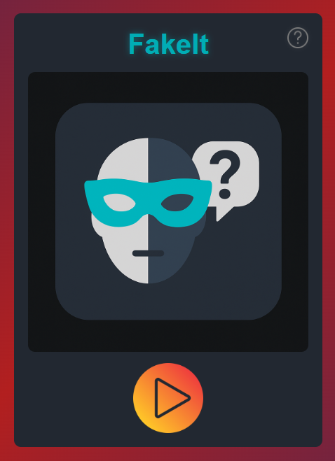
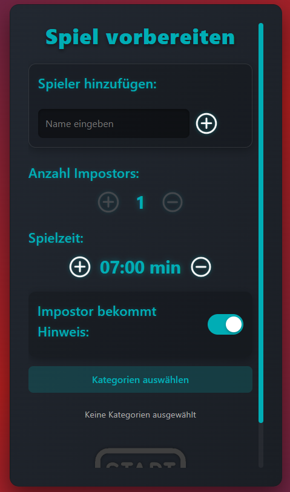
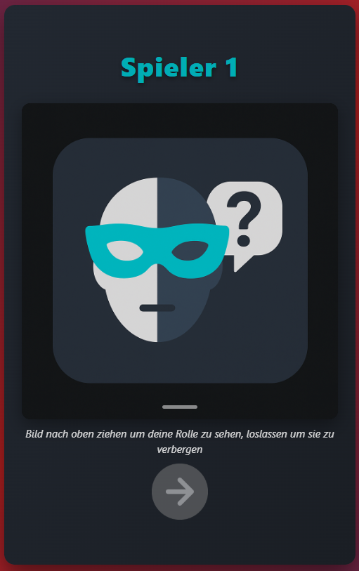

# FakeIt

**FakeIt** ist ein Social-Deduction-Partyspiel als Progressive Web App (PWA). Inspiriert von Spielen wie *Spyfall* und *Among Us* versuchen Crewmates den Impostor zu entlarven, der das geheime Wort nicht kennt.

<p align="center">
  
</p>

## Features

- **Offline spielbar** dank Service Worker und Cache-Strategie
- **Installierbar** als PWA auf Smartphone und Desktop
- **13 vorgefertigte Kategorien** mit je 15 Wörtern und Hinweisen
- **Eigene Kategorien** erstellen, bearbeiten, exportieren und importieren
- **Flexible Spieloptionen**: Spieleranzahl, Impostor-Anzahl, Spielzeit und Hinweis-System einstellbar
- **Replay-Funktion**: Direkt mit denselben Spielern eine neue Runde starten
- **Drag-to-Reveal**: Rollen werden durch Wischgeste aufgedeckt, damit andere nicht mitsehen

## Spielablauf

1. **Spieler hinzufügen** - Mindestens 3 Spieler, Impostor-Anzahl und Kategorien festlegen
2. **Rollen ansehen** - Jeder Spieler zieht das Bild nach oben, um seine Rolle zu sehen. Crewmates sehen das geheime Wort, Impostors nicht (oder nur einen vagen Hinweis)
3. **Diskutieren** - Alle diskutieren reihum ueber das Wort. Crewmates versuchen den Impostor zu entlarven, der Impostor tut so, als kennt er das Wort
4. **Abstimmen** - Nach Ablauf der Zeit wird abgestimmt, wer der Impostor ist
5. **Ergebnis** - Die Impostors werden aufgedeckt. Crewmates gewinnen, wenn sie den Impostor finden. Der Impostor gewinnt, wenn er unentdeckt bleibt
<p align="center">
    
    
</p>

## Technologie-Stack

| Bereich | Technologie |
|---|---|
| Frontend | Vanilla HTML, CSS, JavaScript |
| CSS-Framework | Bootstrap 5.3 (CDN) |
| Routing | Hash-basierte SPA (eigener Router) |
| State | `sessionStorage` (Spielzustand), `localStorage` (eigene Kategorien) |
| Offline | Service Worker mit Cache-First-Strategie |
| Build-Tools | Keine - rein statische Dateien |

## 💻 Verwendung / Installation

FakeIt ist so gestaltet, dass es **ohne Internet** genutzt werden kann und auf fast jedem Gerät läuft.

---

### 🌐 Im Browser (Offline nutzbar)

Du kannst FakeIt einfach im Browser öffnen und danach offline verwenden:

1. Seite einmal online öffnen
2. Browser-Menü → **"Seite speichern"** oder **"Zum Startbildschirm hinzufügen"**
3. Danach funktioniert das Spiel auch **ohne Internet**

Perfekt für:
- Schule
- Reisen
- Orte ohne WLAN

---

### 📱 Als Android-App installieren (Empfohlen)

FakeIt kann als native Android App installiert werden

1. [](https://github.com/der-anonyme-gamer/FakeIt/releases/latest)
2. Installieren und losspielen 

---

### 📱 Als Android-App installieren (PWA)

FakeIt kann wie eine echte App installiert werden:

1. Spiel im mobilen Browser öffnen (z. B. Chrome)
2. Menü → **"App installieren"** / **"Zum Startbildschirm hinzufügen"**
3. FakeIt erscheint dann als eigene App

---

### 🍎 Als iOS-App installieren (PWA)

Auch auf iPhone und iPad kannst du FakeIt als App nutzen:

1. Spiel im Safari-Browser öffnen
2. Unten auf **Teilen** tippen (Quadrat mit Pfeil)
3. **"Zum Home-Bildschirm"** auswählen
4. FakeIt erscheint als eigenes Icon auf dem Home-Bildschirm

---

### 💻 Als Desktop-App installieren

Auch auf PC/Mac kannst du FakeIt als App installieren:

**In Chrome / Edge:**
1. Spielseite öffnen
2. In der Adressleiste auf das **Install-Symbol** klicken
3. "Installieren" auswählen

Danach:
- Start über Desktop-Icon
- Eigenes Fenster ohne Browser-UI
- Offline nutzbar

---

### 📦 Lokale Nutzung (komplett ohne Internet)

FakeIt benötigt keinen Build-Prozess. Da die App `fetch()` verwendet, muss sie über einen lokalen Webserver ausgeführt werden:

```bash
# Repository klonen
git clone https://github.com/dein-benutzername/FakeIt.git
cd FakeIt

# Mit einem beliebigen lokalen Webserver starten, z.B.:

# Python 3
python -m http.server 8080

# Node.js (npx)
npx serve .

# VS Code: "Live Server" Extension verwenden
```

Dann im Browser oeffnen: `http://localhost:8080`

## Kategorien

Die App enthält 13 vorgefertigte Kategorien:

| Kategorie | Beschreibung |
|---|---|
| Einfache Woerter | Alltagsgegenstaende |
| Rund um die Welt | Sehenswuerdigkeiten & Orte |
| Unterhaltung | Filme, Spiele, Serien |
| Alltag | Alltagssituationen |
| Clash Royale | Karten aus dem Spiel |
| Tiere & Natur | Tiere und Naturphaenomene |
| Sport & Freizeit | Sportarten und Aktivitaeten |
| Wissen & Schule | Schulthemen und Wissenschaft |
| Feste & Feiern | Feiertage und Anlaesse |
| Stars und Promis | Beruehmte Persoenlichkeiten |
| Spicy (Ue18) | Party-Begriffe fuer Erwachsene |
| Trends | Aktuelle Trends und Technologie |
| Deutsche Begriffe | Typisch deutsche Konzepte |

**Eigene Kategorien** können über den Kategorienverwaltung erstellt, als JSON exportiert und importiert werden.

## Credits

Alle Icons stammen von [Flaticon](https://www.flaticon.com) und wurden von verschiedenen Designern erstellt. Die vollständige Zuordnung findet sich in der App unter *Info*.

## Lizenz

Dieses Projekt ist unter der **Apache License 2.0** lizenziert. Siehe [LICENSE](LICENSE) fuer Details.

---

FakeIt &copy; 2025-2026 Felix Hausmann
